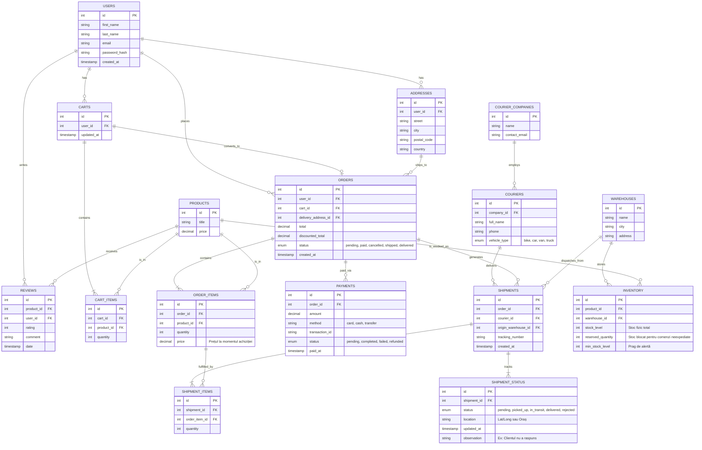
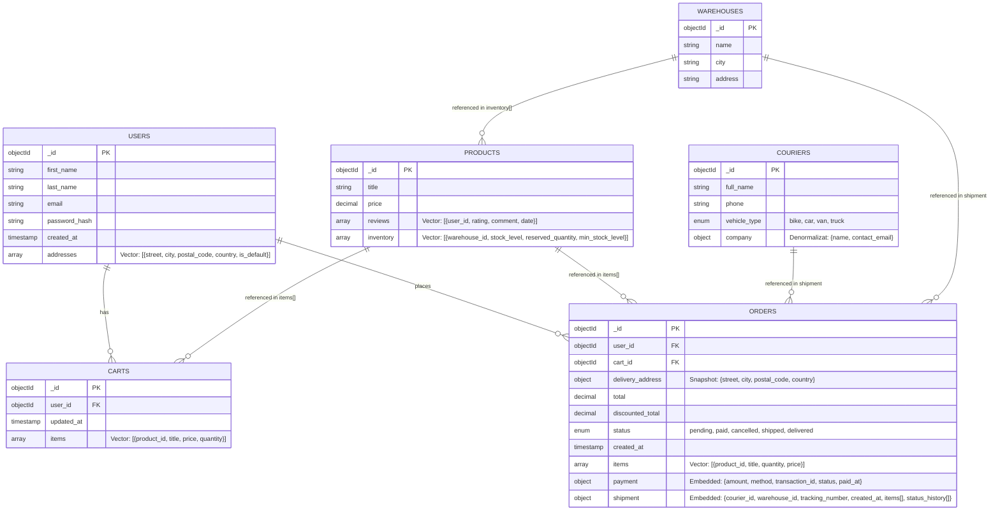

### About

Here you create new directory where you upload the queries:

Example:

```
mkdir iulian
cd iulian
nano script1
```

Install Mermaid extension to see the postgres database ERD diagram:



Mongo diagram:

